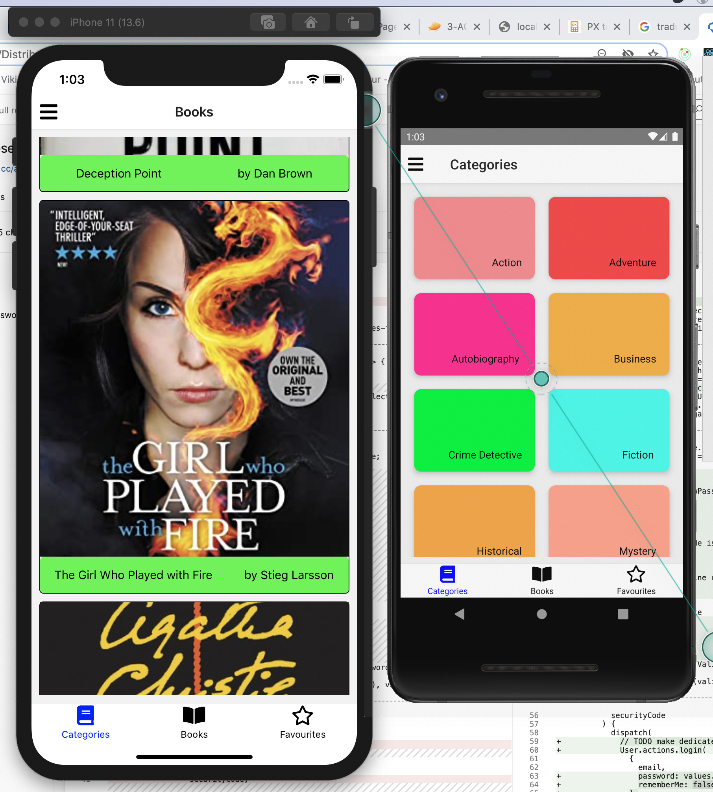
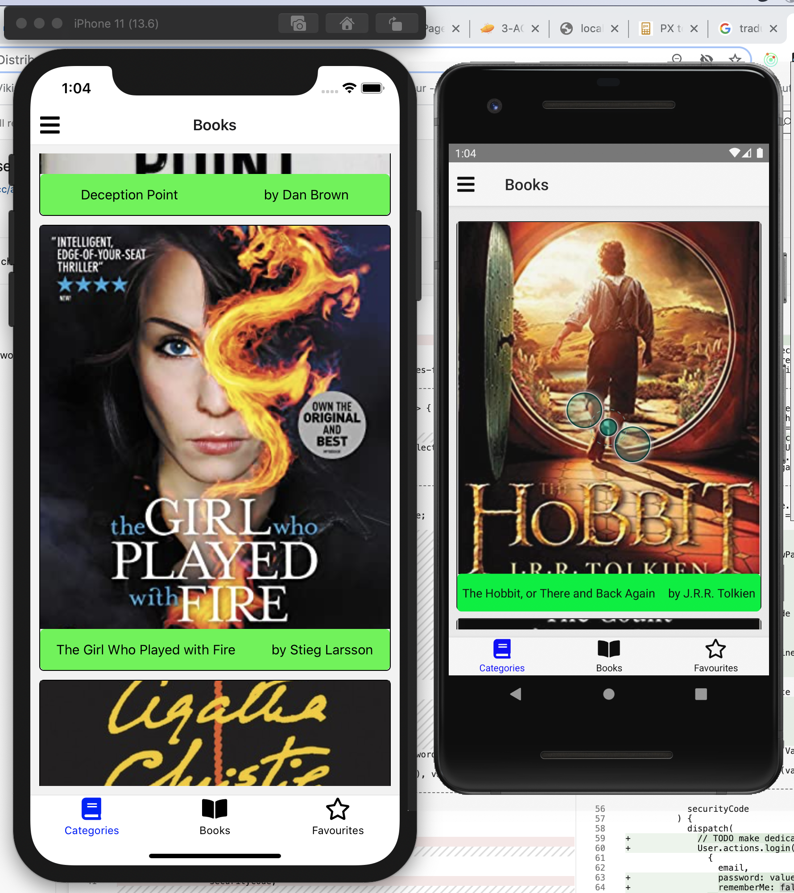
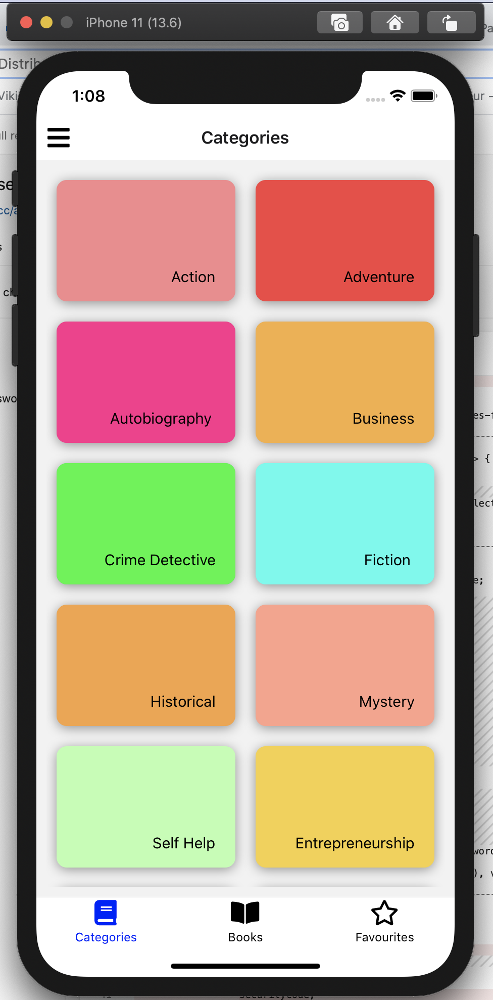
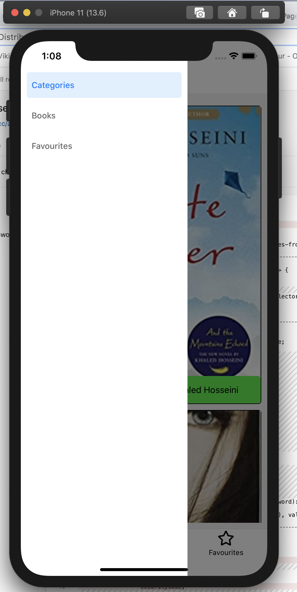

# Screens Setup
    The next step would be to set up screens that would be used in our application.
    I would be setting up 3 screens for the purpose of this demo, feel free to just copy them.
    I would be setting up 3 screens for the purpose of this demo, feel free to just copy them.

# Stack Navigator
    Stack navigation provides a way for react-native apps to transition between screens by using a stack,
    which means the screens are stacked on each other.
    For example, if you navigate from login to signup screen, the signup screen is stacked on top of the login screen,
    and if you navigate back, the signup screen is then popped off the stack.
    To set up the stack navigation, I’d create a navigation-configuration directory at the root of our project.
    Inside our newly created directory,
    I’d also create a StackNavigator.js file in there, and add our stack navigation setup.

# Tab Navigator
    Tab navigation is a navigation that is tabbed at either the bottom or top of a screen and can be used to switch between different screens.
    Tab navigation can take in either the screen as a component or a Stack as the component.
#  Drawer Navigator
    Drawer navigation is a slide-out and slide-in drawer that contains links to various screens.
    The Drawer navigation opens when a menu icon is clicked or when a user swipes their finger from the left or right edge of the app.
#  Conclusion

    
    
    
    
